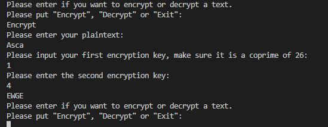
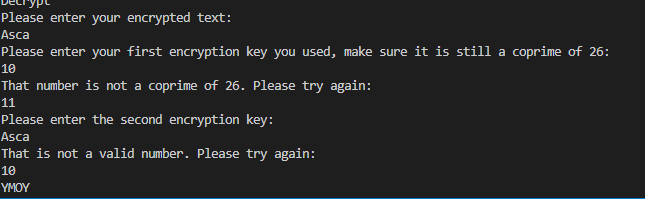

<!DOCTYPE html
<html lang="en">
<head>
    <meta charset="UTF-8">
    <meta name="viewport" content="width=device-width, initial-scale=1.0">
    <title>Mengenal Tabel HTML</title>
</head>
<body>
    <table border="1">
        <tr>
            <td>Nama</td>
            <td>Ananda Prasca Appandi</td>
        </tr>
        <tr>
            <td>NIM</td>
            <td>312010157</td>
        </tr>
        <tr>
            <td>Mata Kuliah </td>
            <td>Kriptografi</td>
    </table>
</body>
</html>

TUGAS PERTEMUAN 7

1. AffineChipper.py

2. BreakAffine.py

Link Github : 
